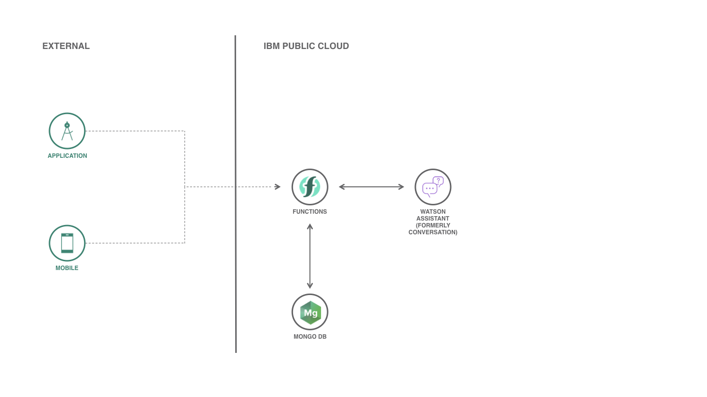

# Create a Serverless Chatbot for your business

[](https://cloud.ibm.com)
[](https://developer.ibm.com/node/)

Use [IBM Cloud Functions](https://www.ibm.com/cloud/functions) and [Watson Assistant](https://www.ibm.com/cloud/watson-assistant-2/) service to create a **serverless** chatbot. There is no need to setup a Virtual Server (or Virtual Machine) or a Cloud Foundry to deploy and use your own chatbot. If you don't know how to build a chatbot, [read my blog](https://medium.com/ibmdeveloperbr/watson-assistant-como-criar-o-seu-chatbot-usando-skills-e-assistants-755b4677984b/).



## Components and technologies

* [IBM Cloud Functions](https://cloud.ibm.com/openwhisk): FaaS (Function-as-a-Service) platform that executes functions in response to events. It is based on Apache Openwhisk project.
* [Watson Assistant](https://cloud.ibm.com/catalog/services/watson-assistant): Watson Assistant lets you build conversational interfaces into any application, device, or channel.
* [MongoDB](https://cloud.ibm.com/catalog/services/databases-for-mongodb): MongoDB is a JSON document store with a rich query and aggregation framework.

## Deployment

To setup and deploy, you need to install [IBM Cloud CLI](https://cloud.ibm.com/docs/cli/reference/ibmcloud/download_cli.html#install_use) and [IBM Cloud Functions CLI](https://cloud.ibm.com/openwhisk/learn/cli) in your local machine and then, follow all steps below.

### 1. Clone this repository.

```sh
git clone https://github.com/victorshinya/serverless-chatbot.git
cd serverless-chatbot
```

### 2. Open the project in a text editor

Replace on `assistant.js`

* `{iam_apikey}` with your Watson Assistant's IAM_APIKEY

* `{workspace_id}` with your Watson Assistant's WORKSPACE_ID

Replace on `mongodb.js`:

* `{mongodb_uri}` with your MongoDB URI

### 3. Deploy all functions

Run all three commands below:

> Deploy `assistant.js` function using Node.js 10.

```sh
ibmcloud fn action create assistant assistant.js --kind nodejs:10
```

> Deploy `mongodb.js` function using Node.js 10.

```sh
ibmcloud fn action create mongodb mongodb.js --kind nodejs:10
```

> Create a `sequence` function and add assistant and mongodb function into it.

```sh
ibmcloud fn action create sequence assistant,mongodb --sequence
```

## License

MIT License

Copyright (c) 2018 Victor Kazuyuki Shinya
